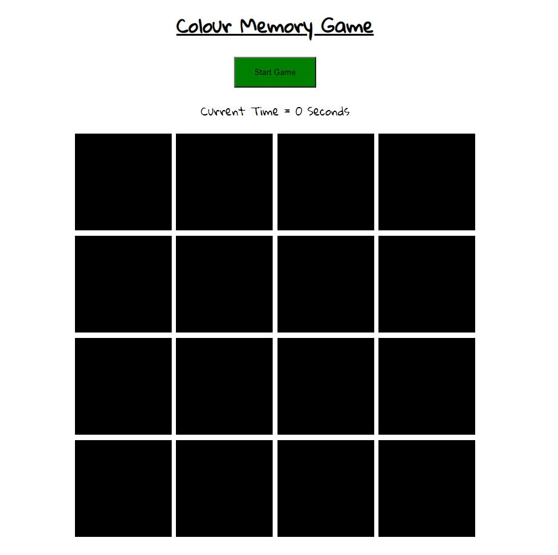
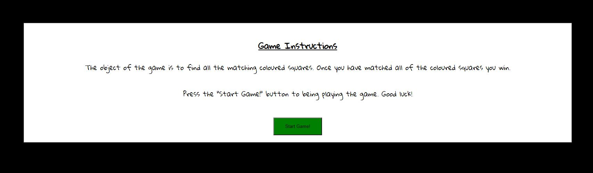
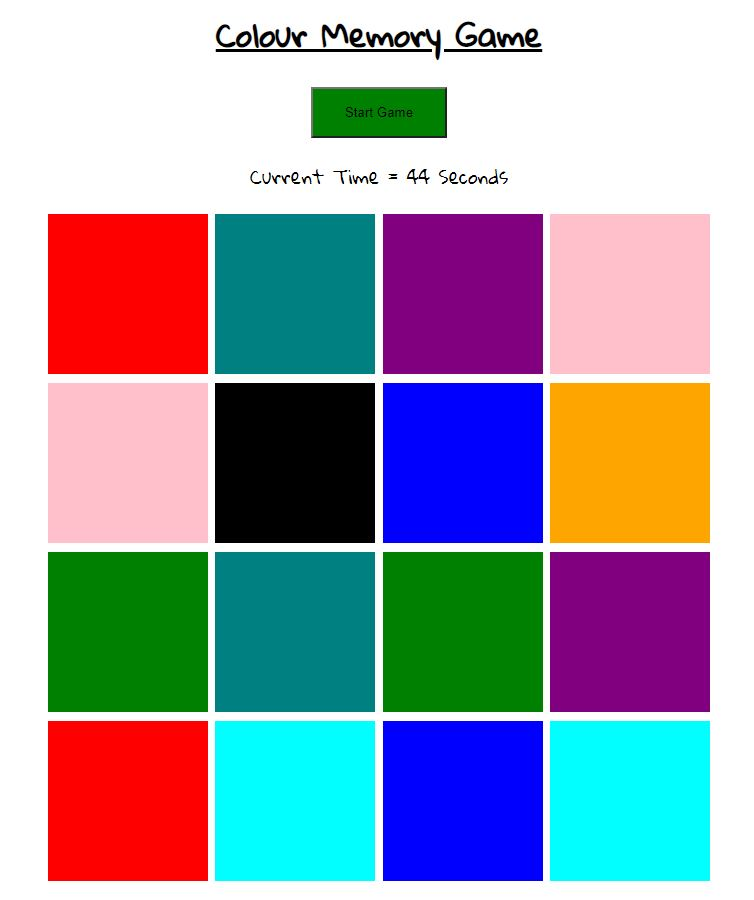
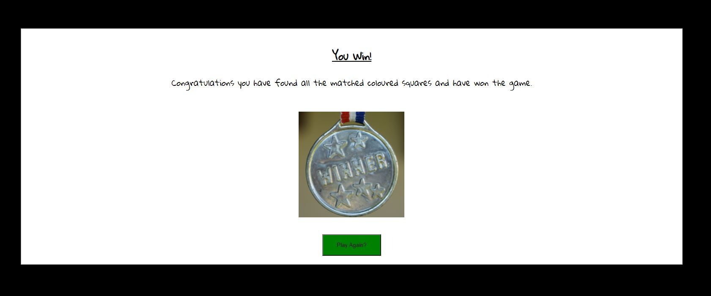
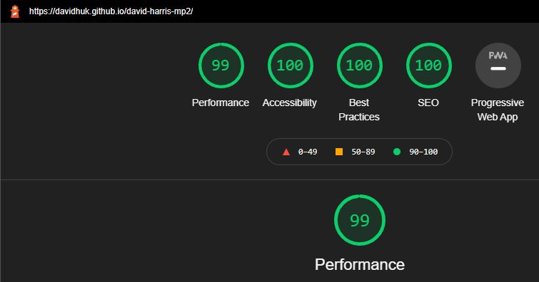

<h1 align="center">David Harris - Milestone Project 2</h1>

[Click here to view my live project](https://davidhuk.github.io/david-harris-mp2/)

## Completed Project Screenshot (Desktop View)

#### Page Initial Load (Game not active)


#### Start Game Modal


#### Game Played (Most colours clicked)


#### Finish Game Modal


The aim of this project is to build a fully interactive front-end only website using the skills that I have learnt with HTML, CSS & JavaScript. I will be building a memory based visual card game. The purpose of the game is firstly to be a fun and enjoyable game but to also be used for education for younger children. The game will be designed with the view to aid in early learning and development for younger children.

## User Experience (UX)

### User stories

#### First Time Visitor Goals
- As a first-time visitor I want to easily understand the main purpose of the website.
- As a first-time visitor I want the game to be very basic and easy to understand as the audience demographic will be younger children.
- As a first-time visitor I want to enjoy the game on the first play through and not hit and frustrations with an overly complicate game or rules.

 #### Returning Visitor Goals
- As a returning visitor I want to see if I can improve on my personal time score since the last visit to the website.
- As a returning visitor I want to continue to enjoy the game on multiple play throughs.

### Design

#### Colour Scheme
- I originally planned to use a bright and bold colour scheme to be aimed at children. I did some research and found that children's games normally use bold colours as it draws their attention.
- The theme of the game was going to be cartoon based animals. I had done some research into younger children’s books and a lot of books involve cartoon animals.
- Decision. As the primary focus of this project is to focus on JavaScript, I decided to dedicate my time to learn, troubleshoot and build JavaScript. I had always planned to work on the JavaScript first, then focus on the CSS & design afterwards. The choice of type of game for this project lead me to take a massive amount more time than planned for the JavaScript than first thought, so I made the choice to sacrifice the additional time spent working through a theme to focus more required time to fully learn and understand the fundamentals of JavaScript required for this game build. This led me to stick to basic colours of white/black/various colours for the matched squares to enable the content to display  without colours clashing to ensure the content is visible, albeit basic looking.

#### Typography
- The font that I have chosen is for this website is “Gloria Hallelujah” via “Google Fonts”. I have chosen this font to appeal to the younger children. I like that this is a non-business, non-serious font. I find that it is a relaxed font and leads itself well to a younger audience.

#### Wireframes
- Please use the links below to download my wireframe designs in PDF format.
- [Desktop View Wireframe](assets/wireframes/wireframe-desktop-view.pdf)
- [Mobile View Wireframe](assets/wireframes/wireframe-mobile-view.pdf)
- [Tablet View Wireframe](assets/wireframes/wireframe-tablet-view.pdf)

The live site appears different from the original wireframe. This is by choice due to timescales for the project delivery deadline. This project was focused on the JavaScript, where I chose to focus my time learning, building, and testing.

The overall design is basic by choice. If I had more time, I would have focused and redesigned the site to add some more flare to the CSS and potentially add back in a front-end framework, Bootstrap for example.

## Features

### Existing Features
- Feature 1 – “Welcome message & Game Instructions”. There will be a pop-up when the user presses the start button to offer an instructional message with a brief set of simple instructions on how to play & win the game. This is designed to make it as easy as possible for younger children to both understand and enjoy playing the game.
- Feature 2 – “Memory-based Card Game”. This will be the bulk of the content of the website. There will be a 4 x 4 flip card-based memory game. The object of the game will be to correctly match all pairs of cards in as least moves as possible.
- Feature 3 – “Total Time Taken Timer”. There will be a timer starting from 0 seconds that will start counting when the user starts the game. This will enable the user to track the time it takes them to complete the game.

### Features Left to Implement
- I would like to have a way to display the total time it took for the user to complete the game on the "win modal pop-up". I tried to get this coded but there was a bug on the timer that meant the variable's seconds kept getting tracked. This meant that the data shown was always wrong. I ran out of time to get this fully working.
- I would like to have a way to display the lowest total time taken for the user on a game session. They could use this to compare visually and try to beat their score. I was not able to get this coded within the time frame for the same issue as before. There was a bug with the timer meaning it kept on running after game win, this breaking this feature.
- I would like to have a way to randomise the game colours on each play. This would give the user more fun when playing the game on multiple playthroughs due to being a random layout instead of the same colour locations each time.

## Technologies Used

### Languages Used
- [HTML:](https://en.wikipedia.org/wiki/HTML) This project uses HTML for the basic structure of the data.
- [CSS:](https://en.wikipedia.org/wiki/Cascading_Style_Sheets) This project uses CSS for applying custom styles to the HTML.
- [JavaScript:](https://en.wikipedia.org/wiki/JavaScript) This project uses JavaScript to modify the HTML & CSS to allow the user to interact with and play the memory-based game.

### Frameworks, Libraries & programs Used
- [Google Fonts:](https://fonts.google.com/) Google Fonts were used to import the "Gloria Hallelujah" font into the style.CSS file which is used on all pages throughout the project.
- [Font Awesome:](https://fontawesome.com/) Font Awesome was used on all pages throughout the website to add icons for aesthetic and UX purposes.
- [Git:](https://git-scm.com/) Git was used for version control by utilizing the GitPod terminal to commit to Git and Push to GitHub.
- [GitHub:](https://github.com/) GitHub is used to store the projects code after being pushed from Git.
- [Balsamiq:](https://balsamiq.com/) Balsamiq was used to create the wireframes during the design process.
- [Hover.css:](https://ianlunn.github.io/Hover/) Hover.css was used on game squares and the various buttons to change the inside border colour while the elements are being hovered over.

## Testing

### Testing User Stories from User Experience (UX) Section

#### First Time Visitor Goals
1. As a first-time visitor I want to easily understand the main purpose of the website.
- When you load to the website you are greeted with the game and a press start button.
- when you press start (When you are ready to play) you are presented with a pop-up with simple game instructions.
- This means that anyone who has not played the game before should be able to play the game for the first time without any issues.

2. As a first-time visitor I want the game to be very basic and easy to understand as the audience demographic will be younger children.
- This is a basic 4 x 4 colour matching game.
- I picked this game as it is easy to understand for a younger audience.

3. As a first-time visitor I want to enjoy the game on the first play through and not hit and frustrations with an overly complicate game or rules.
- The game will only start when you press start (Once ready).
- The game logic will automatically loop matches until you win. There is no timeout, break, error, or rush. This to allow lots of time for younger children as much time as possible to complete the game without the user being rushed.

#### Returning Visitor Goals
1. As a returning visitor I want to see if I can improve on my personal time score since the last visit to the website.
- There is a 1 second count timer that increases by 1 for every second that the game passes before the user finds all matched colours.
- This timer allows the user to see how long it takes them before they win.
- The user can track their times, remember them, and compare to their future attempts.
- A future update could be to implement a user log in & account, then add a database to push & pull their best times. This would allow tracking and improving their best score automatically during multiple visits.

2. As a returning visitor I want to continue to enjoy the game on multiple play throughs.
- I originally planned to include a randomiser to the game colours locations. This would have meant that the game will be a fresh play on each play thorough. I ran out of time for this feature due to project deadlines. I focused on getting a working game for 1st submission. This will be planned for a future release.

### Features Testing
1. Feature 1 – “Welcome message & Game Instructions”. I originally planned to have this appear automatically upon page load but decided against this as I wanted to allow the website to load first and then allow time for the user to see all the content on their device without interruption.
- During testing I moved the instruction pop-up to a hidden modal that appears when the user presses the start game button.
- I think that this is a good compromise as it keeps things clean and does not bombard the user on page load with popups instantly.

2. Feature 2 – “Memory-based Card Game”. This will be the bulk of the content of the website. There will be a 4 x 4 flip card-based memory game. The object of the game will be to correctly match all pairs of cards in as least moves as possible.
- I constantly tested and added to this game during the build of the website.
- The game in its current state works perfectly (if the user does not spam click the squares). The game will loop round and allow for unlimited play.
- There were many stages with the game build that went wrong, but I constantly added logic and variables throughout the game build to troubleshoot & fix. I learnt a lot due to hitting many different issues.

## Different Device Testing
- IPhone XR, IPhone 7 (Portrait mode). Tested the game many times throughout the build process. The game always appears fine on this screen size.
- Various Android mobiles (Portrait mode). Tested the game many times throughout the build process. The game always appears fine on this screen size.
- Desktop PC with 27-inch monitor @ 1920 x 1080 resolution. Tested the game many times throughout the build process. The game always appears fine on this screen size.
- Laptop 15-inch monitor @1920 x 1080p resolution. Tested the game many times throughout the build process. The game always appears fine on this screen size.
- Responsinator (Portrait mode). I used this site to test many emulated device sizes (with portrait mode) many times throughout the build process. The game always appears fine in portrait mode.

## Deployment Testing
- I have tested my live site that is hosted on GitHub Pages - "https://github.com/davidhuk/david-harris-mp2".
- I checked and confirmed that the code is the same as the code matches the same code in the IDE.
- I fully tested the game on a laptop, desktop and mobile to make sure the game is fully function in the same way as in the IDE.
- I fully tested and confirmed that there are no errors with the code when playing the game or accessing the site.
- I run the live code via HTML, CSS & JavaScript testing tools to confirm the code passes the tests still.
- I am happy the live site is deployed in a working state that I am happy with.

### Errors During Testing
- Bootstrap, Grid Layout, Multiple Stacked Images: I struggled with getting 2 x images to stack over each other, take up the same size, remain hidden then flip. I encountered many problems with grid alignment at various view sizes and layouts. I ended up spending way too much time troubleshooting HTML, CSS, Bootstrap. This was detrimental to the time scale for project deadline and was not a requirement as this project is focused on the JavaScript. I decided to remove Bootstrap and the images.
- JavaScript: As the game needed to match 2 x colours, I needed a way to get HTML elements and compare them. I tried to use the class names, but it was not as simple as accessing by class name as this would mean I would have to code 8 or 16 different logic. I did some research and it seemed like using data type would be a basic method that I could use for the game. I used the following links - "https://www.w3schools.com/tags/att_data-.asp" & "https://stackoverflow.com/questions/20030162/getting-data-attribute-for-onclick-event-for-an-html-element" for guidance.
- Game Timer: Timer keeps running after game win. I noticed that once the timer function is started it would not stop. I researched online and discovered that you can stop a JavaScript function with another function is running. I thought you could, so planned to call a function to stop the timer function on game win, but this is not possible. A solution was to force a refresh of the webpage to restart the game and all the code logic. Although this is not an ideal fix, for this project it is a perfect working solution to complete the game loop with a working timer.

### Known Bugs & Issues
- JavaScript: Multiple fast clicking. If a user clicks multiple squares in rapid succession, it can cause issues & bugs with the coloured squares. There is a delay timer for the code to revert CSS classes if no match is found. I have done some investigation to try and fix this but have not been able to come up with an answer without having to re-format the entire JavaScript code. The fix that I have in my head would be to add another new CSS class to disable mouse click events for all .card elements, apply it to all cards on mismatch (before the timer), then remove this CSS class from all the .card elements when the timer kicks in to run the delayed code. This would work, but I have tried and failed to patch this in time code during the timeframe of the delivery of this project. The game works flawlessly if the user is not clicking really, fast. For standard users/use (little children), I would not expect this to be a widely reported bug but would be one to work on and fix with 1st wave bug fixes in future build releases.
- Smaller device, landscape mode. On smaller devices such as mobiles and smaller tablets, the game does not scale well on landscape mode. I have tried a few different styles and layouts to re-size and scale the content, but I cannot really get the game to fit and be playable. I have built and designed this game to be mainly focused and run-in portrait mode. I have tested this on many different sized phones including iPhone 7, iPhone X, iPhone XR & a few different smaller Android mobiles. While in portrait mode the game appears fine as is fully playable at a decent size.

### Testing Tools Used
- [W3C Markup Validation Service:](https://validator.w3.org/) I used this website to test, validate, highlight, and fix errors in my HTML code. The final code has passed all checks and has produced the result - "Document checking completed. No errors or warnings to show.".
- [W3C CSS Validation Service:](http://jigsaw.w3.org/css-validator/) I used this website to test, validate, highlight, and fix errors in my CSS code. The final code has passed all checks and has produced the result - "Congratulations! No Error Found.".
- [JSLint:](https://jslint.com/) I used this website to test, validate, highlight, and fix errors in my JavaScript code.
- JSLint Error 1 - "Unexpected ++". Researched and fixed by changing JavaScript code from "gameWin++; to gameWin = gameWin +1;" code as found here "https://stackoverflow.com/questions/3000276/the-unexpected-error-in-jslint".
- JSLint - Error 2 "Function out of scope". Researched and fixed by moving code as found here "https://stackoverflow.com/questions/34614490/jslint-out-of-scope-error-due-to-function-ordering".
- JSLint - Error 3 "Expected 'function' and instead saw '=>'.". Researched and fixed by modifying "SetTimeOut =>" to "setTimeout(function ()" as found here "https://www.w3schools.com/jsref/met_win_settimeout.asp".
- JSLint - Testing results. I have fully tested, changed JavaScript code, and got the code to a pass within JSLint. This is with using the parameters of "Assume in a browser" & "Tolerate long lines of code". I enabled these for JSLint as the code will always be run in a browser, aka Desktop and IPhone, also the long line of code error is due the comment in my code which a required for the project review to show my working and note where I have worked on code etc. I understand this is not best practice but due to project submissions requiring comments, I cannot get rid of the long code JSLint error.
- [Responsinator](http://www.responsinator.com/) I used this emulation tool to enable me to perform testing on multiple device viewpoints at the same time. I focused my design to have this game play in portrait orientation. I understand that it is not best played in landscape mode. Given time, I would redesign this via a front-end framework to allow some scaling for landscape mode but did not have the time before the project deadline submission.
- [Google Lighthouse](https://developers.google.com/web/tools/lighthouse) I used this tool to test my website, validate, highlight, and fix various errors in all my code. This was mainly used to highlight potential miss-code with current best practices with a 99 % score. The score reduction is due to third-party Google Fonts code, this is required for the custom font style. The results would be 100%  otherwise. Results attached as screenshot below.


## Deployment

### GitHub Pages
The project was deployed to GitHub Pages using the following steps...

1. Log in to GitHub and locate the [GitHub Repository]( https://github.com/davidhuk/david-harris-mp2)
2. At the top of the Repository (not top of page), locate the "Settings" Button on the menu.
3. Scroll down the Settings page until you locate the "GitHub Pages" Section.
4. Under "Source", click the dropdown called "None" and select "Master Branch".
5. The page will automatically refresh.
6. Scroll back down through the page to locate the now published site [GitHub Pages]( https://davidhuk.github.io/david-harris-mp2/) in the "GitHub Pages Live Website" section.

### Forking the GitHub Repository
By forking the GitHub Repository we make a copy of the original repository on our GitHub account to view and/or make changes without affecting the original repository by using the following steps...

1. Log in to GitHub and locate the [GitHub Repository](https://github.com/)
2. At the top of the Repository (not top of page) just above the "Settings" Button on the menu, locate the "Fork" Button.
3. You should now have a copy of the original repository in your GitHub account.

### Making a Local Clone
1. Log in to GitHub and locate the [GitHub Repository]( https://github.com/davidhuk/david-harris-mp2)
2. Under the repository name, click "Clone or download".
3. To clone the repository using HTTPS, under "Clone with HTTPS", copy the link.
4. Open Git Bash
5. Change the current working directory to the location where you want the cloned directory to be made.
6. Type `git clone`, and then paste the URL you copied in Step 3.

```
$ git clone https://github.com/davidhuk/david-harris-mp2
```

7. Press Enter. Your local clone will be created.

```
$ git clone https://github.com/davidhuk/david-harris-mp2
> Cloning into `CI-Clone`...
> remote: Counting objects: 10, done.
> remote: Compressing objects: 100% (8/8), done.
> remove: Total 10 (delta 1), reused 10 (delta 1)
> Unpacking objects: 100% (10/10), done.
```

Click [Here](https://help.github.com/en/github/creating-cloning-and-archiving-repositories/cloning-a-repository#cloning-a-repository-to-github-desktop) to retrieve pictures for some of the buttons and more detailed explanations of the above process.

## Credits

### Font
- “Gloria Hallelujah” font taken directly via Google Fonts - https://fonts.google.com/specimen/Gloria+Hallelujah?preview.text_type=custom#standard-styles Licence details - https://scripts.sil.org/cms/scripts/page.php?site_id=nrsi&id=OFL

### Favicon
- Favicon.ico was created by me via this free website - https://favicon.io/favicon-generator/ Terms of use located here - https://favicon.io/terms-of-use/

### Images
- Winner Medal – Image by <a href="https://pixabay.com/users/axxlc-1861698/?utm_source=link-attribution&amp;utm_medium=referral&amp;utm_campaign=image&amp;utm_content=1548239">AxxLC</a> from <a href="https://pixabay.com/?utm_source=link-attribution&amp;utm_medium=referral&amp;utm_campaign=image&amp;utm_content=1548239">Pixabay</a>.

## Conclusion
Bootstrap - Stacked multiple images & Grid Layout. My initial idea for this project was to use an animal memory game, have an image of a playing card as a default on page load, once clicked, flip and show an image of an animal. I had issues with getting this lined up in a grid within Bootstrap, then scaling images correctly, then hiding and showing images. I would be able to fix these given more time but decided against this due to 1. The images not being required for the project, 2. Needed to focus of the JavaScript part of the game to get a functional game rather than a nice-looking game and 3. The project deadline fast approaching, I needed to focus on a producing a minimum viable build product that fits the criteria.

Time management Issues & Initial Project Miss-Scoped. This module focuses on the JavaScript aspect of interaction and manipulation of the DOM. I am still learning HTML, CSS, Bootstrap and have added in JavaScript to this product. I am still learning the basics of all these languages. I started this project slightly later than planned as I needed to take more time to really explore and understand the fundamentals of JavaScript, this led to me having a tighter deadline. The second mistake I made was not fully exploring the difficulties of having images for the game. It seemed easy enough but added a level of complexity that was not required for the project. I found that I was spending way too much time troubleshooting HTML, CSS & Bootstrap and not working on JavaScript, which is the primary driver for this product. I decided to reduce complexity and focus on a colour matching game and remove the images to allow me to explore the JavaScript.

I had to make the tough choice to sacrifice time spent on the front-end design, HTML, CSS etc. I found that the more I learnt, tried, and built with JavaScript, the more problems I encountered. This led to more time learning, building, and testing. This then impacted the deadline and made me have to re-scope and aim for a more basic designed game.

Overall, I am very happy with the progress I have made with JavaScript. The build for this game has been very challenging, many times I hit dead-end walls with ideas I have had, but once researched, 1. The ideas do not work due to the design of the game logic, or 2. Needs a lot more advanced features and logic flow to run, meaning lots of time for something that I thoughts would be a simple fix.

If I had the chance to start this project over with a fresh timescales & deadline, with my new understanding of JavaScript, I would aim to have different features, aim to have smaller separate functions that can be called upon independently. I finally understood why having separate functions in JavaScript is best practice is and is a good idea, unfortunately this was past the point of new return of timescales for delivery during this project. This was a double-edged sword though; I am partly glad that I made a new coder mistake of too much logic within on function early on in my career as it taught me a harsh lesson and forced me into stressful situations but forced me to learn a lot at a rapid rate to fix the mistakes.